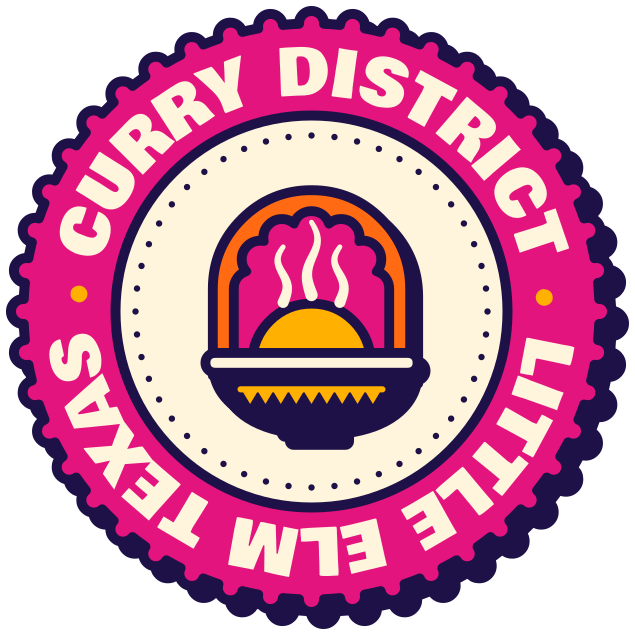

# Curry District · A · BAZAAR — site style guide (for sibling page builders)

Loud, joyful, saturated: thick 3px indigo outlines, hard offset "sticker" shadows, tilted cards, chunky
Bowlby One headlines, DM Sans body, Caveat hand-lettered asides. Mobile-first at 390px, then 768 / 1280.

**Fastest start:** copy `menu.html` (or any stub) and replace only what is inside `<main id="main">…</main>`.
The head, concept banner, header, mobile drawer, footer and bottom action bar are already correct and
must stay identical on every page (they are plain static HTML; there is no include system).

---

## 1. Folder map (everything is self-contained — never reference `../../brand`)

```
index.html  menu.html  catering.html  story.html  visit.html  404.html   ← pages (404 uses root-absolute /paths)
css/site.css        shared tokens + components (this guide)          css/home.css   home-only
js/config.js        window.CD_CONFIG — phone, hours, links, ratings: THE single source of facts
js/site.js          banner, nav drawer, open-now, hours tables, bottom bar, marquee pause, snap rails, Motion.init
js/menu-data.js     window.CD_MENU — 105 dishes (prices stripped). data/menu.json = same, for fetch()
js/home.js          home-only (spice slider)
vendor/motion.min.js + motion.css    brand motion kit (data-attribute driven, see §7)
assets/fonts/       bowlby-one.woff2, dm-sans.woff2 (variable 400–800), caveat.woff2 (400–700)
assets/logo/        wordmark-horizontal.svg (header), wordmark-stacked.svg, emblem(-small).svg,
                    stamp-district-seal.svg, colourways/<asset>--{full-colour|reversed|mono-indigo|mono-cream|mono-saffron}.svg
assets/art/<key>.svg          dish illustrations WITH built-in steam/sparkle animation (use in )
assets/art/static/<key>.svg   same, no animation (use inside <picture> for prefers-reduced-motion)
                    keys: biryani butter-chicken garlic-naan paneer-tikka samosa-chutney tandoori-platter
                          chaat chilli-chicken dal-saag gulab-jamun mango-lassi-chai thali   (800×800)
assets/hero/        {portrait|landscape}-{back|mid|front}(-static).svg  parallax layers of "The District at Golden Hour"
assets/patterns/    NN-name-{fresh|sunset|night}.svg  (01 garland, 02 chili-lime, 03 booti, 04 rangoli, 05 chai, 06 confetti, 07 arches, 08 tiffin)
assets/icons/sprite.svg       all brand icons: #icon-<name> (colour) and #icon-<name>-mono (currentColor)
_qa/                QA screenshots (stripped before deploy)
```

## 2. Page skeleton (what every page has, in order)

1. `<head>`: title / description from `data/copy.json → bazaar.seo`, **`<meta name="robots" content="noindex,nofollow">`**,
   canonical + OG/Twitter (absolute `https://curry-district-bazaar.netlify.app/og-image.png`), icons, manifest,
   2 font preloads, `vendor/motion.css`, `css/site.css`, the one-line **pre-paint script** (banner flag + motion-kit
   `m-js`/`m-arrive` flags with a 3 s failsafe — copy it verbatim from a stub), then deferred
   `js/config.js` → `vendor/motion.min.js` (`data-manual`) → `js/site.js`. Add page CSS/JS after these.
2. `.skip-link` → `.concept-banner` → `header.site-header` → `#nav-drawer` → `<main id="main">` → `footer.site-footer` → `nav.bottom-bar`.
3. Set `aria-current="page"` on your page's links in **both** `.nav` and `.nav-drawer` (stubs already do).
   Both navs carry `data-transition`, so internal page changes get the Bazaar curtain wipe (rani + ink). It only
   works if the destination page has the same head (pre-paint script + motion kit), so keep the head identical.
   **Updated 00:50 UTC:** if you copied a stub before then, re-copy the `<head>` script line and the two `<nav … data-transition>` attributes.
4. Footer disclaimer must stay verbatim: *Independent design concept prepared as a proposal — not the official Curry District website.*

## 3. Tokens (css/site.css `:root`)

| Token | Value | Use |
|---|---|---|
| `--bz-ink` | #1D1147 | text, outlines, shadows, dark sections |
| `--bz-cream` | #FFF4DC | page ground, text on dark |
| `--bz-marigold` | #FFB000 | sunny sections, accents on ink |
| `--bz-saffron` | #FF6A13 | primary buttons, hero panel |
| `--bz-rani` / `--bz-rani-text` | #E4147E / #D0106F | pink accents / pink that may carry cream body text |
| `--bz-peacock` | #00A8A0 | teal sections (ink text only) |
| `--bz-chili`, `--bz-cilantro`, `--bz-sky` | #D62839, #3FA34D, #7B5CFF | spice, veg, tiny violet doses |
| light tints | `--bz-mari-lt` #FFD56E · `--bz-pink-lt` #FF8CC0 · `--bz-teal-lt` #8FE3DA · `--bz-sand` #FFE3B3 | art backgrounds, chips |
| `--shadow-pop` / `-md` / `-sm` / `-xs` | 6/5/4/3px hard ink offset | sticker shadow sizes |
| `--stroke` | 3px solid ink | every card / button outline |
| `--fs-hero` `--fs-h2` `--fs-h3` `--fs-lead` `--fs-hand` | clamp() scale | type scale |

### Contrast rules (measured, WCAG AA)
- **Saffron, marigold, peacock grounds → INK text only.** Cream on saffron is 2.6:1 and cream on peacock 2.7:1: never.
- Cream text is fine on ink (15.7), `--bz-rani-text` (4.8), chili (4.55). Plain `--bz-rani` with cream only for ≥24px display text.
- Accent text on cream: `--bz-rani-text` for large/Caveat kickers only; body text stays ink or `--c-muted` #5B4F85 (6.6).
- On ink: marigold (9.4), saffron (6.0), cream. Keep pink/teal for big display words.
- Big cream "sticker letters" (`.text-sticker`) are allowed on saturated grounds only at ≥2.4rem (the ink stroke carries contrast).

## 4. Typography

```html
<p class="kicker">Explore the District</p>          <!-- Caveat, rotated, takes --sec-accent colour -->
<h1 class="h-hero">The District Menu</h1>           <!-- Bowlby One uppercase -->
<h2 class="h2">Crowd-pleasers</h2>   <h3 class="h3">Biryani Boulevard</h3>
<p class="lead">Bigger intro paragraph…</p>
<p class="small-print">Spice levels are estimates…</p>  <!-- uses --sec-soft (contrast-safe per section) -->
<span class="hl">highlighted word</span>   <span class="hand">Caveat aside</span>
```
Hindi (Bazaar only): max one phrase per screen, gloss in English the first time, wrap it:
`<span lang="hi-Latn">Bas, ek aur naan</span> (okay, just one more naan)`. Never on a button by itself or in hours/addresses.

## 5. Components

### Sections (alternate saturated grounds; each sets `--sec-bg/--sec-fg/--sec-accent/--sec-soft/--focus`)
```html
<section class="sec sec--marigold edge-scallop" aria-labelledby="x-title">
  <div class="wrap">
    <div class="sec__head" data-reveal>
      <p class="kicker">Fan favourites</p>
      <h2 class="h2" id="x-title">Crowd-pleasers</h2>
      <p>Intro line.</p>
    </div>
    …
  </div>
</section>
```
Variants: `sec--cream | sec--white | sec--marigold | sec--saffron | sec--peacock | sec--rani | sec--chili | sec--ink | sec--night`.
Top edges: `edge-scallop` or `edge-zigzag` (the section's own colour bites into the one above). `sec--tight` = less padding.
`.sec__head--center` centres the head. Containers: `.wrap` (1200), `.wrap--narrow` (860), `.wrap--wide` (1400).
Pattern strips: `<div class="pattern-band pattern-band--garland|--tiffin|--rangoli-night|--arches" aria-hidden="true"></div>`.

### Buttons (chunky sticker buttons, hard offset shadow, press-in on tap)
```html
<a class="btn btn--primary" href="https://curry-district-little-elm.cloveronline.com/" data-cfg-href="order" target="_blank" rel="noopener">
  <svg class="ico" aria-hidden="true" focusable="false"><use href="assets/icons/sprite.svg#icon-shopping-bag-mono"></use></svg>Order pickup</a>
<a class="btn btn--cream" href="menu.html">See the menu</a>
<a class="btn btn--ink" …>Order online</a>           <!-- ink + marigold shadow: best primary on saffron/marigold -->
<a class="btn btn--rani btn--sm" …>Plan my party</a>
<div class="btn-row">…</div>                          <!-- wrapping row with gaps -->
<a class="link-arrow" href="#">Read more <svg class="ico"…#icon-arrow-right-mono…></a>
```
Colours: `btn--primary` (saffron) · `--marigold` · `--cream`/`--secondary` · `--white` · `--ink` · `--rani` · `--peacock` · `--ghost`.
Sizes: `btn--sm` (44px) · default (52px) · `btn--lg` (60px) · `btn--block`. On ink grounds wrap in `.on-dark` for a marigold shadow.
CTA wording: `data/copy.json → bazaar.ctas`. Every Order CTA → Clover (`data-cfg-href="order"`). Delivery apps are secondary.

### Chips, badges, open-now status
```html
<span class="chip chip--marigold">Veg-friendly</span>   <!-- --cream --peacock --pink --ink ; <a class="chip"> = 44px tap target -->
<span class="badge">Fan favourite</span>              <!-- --marigold --ink ; add badge--float to pin on a card art corner -->
<p class="status-chip" data-open-status><span class="status-chip__dot" aria-hidden="true"></span><span class="status-chip__text">Lunch from 11 AM · dinner from 4:30 PM</span></p>
<p class="small-print" data-open-caveat>Hours as listed publicly. Call to confirm on holidays.</p>   <!-- always next to the chip -->
```

### Cards (white, ink outline, hard shadow; optional ±2° tilt)
```html
<article class="card card--tilt-l">
  <div class="card__art" style="--art-bg: var(--bz-teal-lt)">
    <span class="badge badge--float">Fan favourite</span>
    
  </div>
  <div class="card__body">
    <h3 class="card__title">Chicken Dum Biryani</h3>
    <p class="card__text">The big boss of Biryani Boulevard. Lift the lid, inhale, swoon.</p>
    <div class="card__meta">
      <span class="diet diet--nonveg">Non-veg</span>
      <span class="spice"><span class="spice__pips" aria-hidden="true">
        <svg class="ico"><use href="assets/icons/sprite.svg#icon-chili-1"></use></svg>
        <svg class="ico"><use href="assets/icons/sprite.svg#icon-chili-1"></use></svg>
        <svg class="ico is-off"><use href="assets/icons/sprite.svg#icon-chili-1"></use></svg>
        <svg class="ico is-off"><use href="assets/icons/sprite.svg#icon-chili-1"></use></svg></span>Medium</span>
    </div>
  </div>
</article>
```
`card--tilt-l|r`, `card--cream`, `a.card` / `.card--lift` (hover lift). Art frames are 4:3 by default, so a real photo can drop in later.
**Dishes with `art: null` get a typographic or icon tile, never another dish's picture:**
```html
<!-- big frames: the dish word as sticker letters -->
<div class="card__art"><div class="art-tile" style="--art-bg: var(--bz-chili)"><span class="art-tile__word">Vindaloo</span></div></div>
<!-- small frames: a zone icon on a light tint (starters spoon-fork · tandoor tandoor-oven · curry curry-bowl ·
     biryani biryani-pot-handi · indochinese rice-bowl · bread naan · sweets spoon-fork · chai lassi-glass) -->
<div class="card__art"><div class="art-tile art-tile--icon" style="--art-bg: var(--bz-teal-lt)">
  <svg class="art-tile__icon" aria-hidden="true"><use href="assets/icons/sprite.svg#icon-curry-bowl"></use></svg></div></div>
```
Diet marks always carry text: `.diet--veg` "Veg" · `.diet--nonveg` "Non-veg" · `.diet--egg` "Egg" (add `.diet--on-dark`
when the mark sits directly on ink — never inside a white card). Spice: 0 Not spicy · 1 Mild · 2 Medium · 3 Hot ·
4 District Hot — render `level` chilli pips (none for 0) followed by the word, e.g. home's crowd-pleaser cards.

### Marquee ticker (pause button required — WCAG 2.2.2)
```html
<section class="marquee" aria-label="Signature dishes">
  <div class="marquee__track" data-marquee="45">
    <span class="marquee__item">Butter Chicken <svg class="marquee__sep" aria-hidden="true">…</svg></span> …
  </div>
  <button class="marquee__toggle" type="button" data-marquee-toggle aria-pressed="false" aria-label="Pause the dish ticker">
    <svg class="i-pause" viewBox="0 0 16 16" aria-hidden="true"><path d="M3 2h3v12H3zM10 2h3v12h-3z" fill="currentColor"/></svg>
    <svg class="i-play" viewBox="0 0 16 16" aria-hidden="true"><path d="M4 2l10 6-10 6z" fill="currentColor"/></svg></button>
</section>
```

### Horizontal snap rail
```html
<div class="snap-ctrl"><button type="button" data-snap-prev="#rail" aria-label="Previous">…</button><button type="button" data-snap-next="#rail" aria-label="Next">…</button></div>
<ul class="snap" id="rail" role="list" tabindex="0" aria-label="Dishes"><li>…card…</li>…</ul>
```

### Ratings badges (only the four public figures, each labelled; no quotes, no aggregateRating)
```html
<ul class="ratings" role="list"><li><a class="rating" href="https://www.yelp.com/biz/curry-district-little-elm" target="_blank" rel="noopener">
  <span class="rating__platform">Yelp</span><span class="rating__approx"></span>
  <span class="rating__score" data-count="4.0">4.0</span><span class="visually-hidden"> out of 5</span>
  <span class="rating__count">120 reviews</span><span class="rating__label">as listed publicly, Oct 2026</span></a></li></ul>
```
Google ≈4.2 (about 1,000 reviews, write "about" in `.rating__approx`) · Uber Eats 4.5 (2,000+ ratings) · Restaurantji 4.5 (479) · Yelp 4.0 (120).

### Hours table, map, stamp
```html
<table class="hours"><caption class="visually-hidden">Opening hours</caption><tbody data-hours>…static fallback rows…</tbody></table>
<div class="map-frame"><iframe data-cfg-src="mapEmbed" src="https://www.google.com/maps?q=11851+FM+423+Suite+200+Little+Elm+TX+75068&output=embed"
  title="Map showing Curry District, 11851 FM 423, Suite 200, Little Elm" loading="lazy" referrerpolicy="no-referrer-when-downgrade"></iframe></div>
<div class="stamp stamp--spin"></div>
```
Logo minimums (brand README): horizontal ≥160px wide, stacked ≥120px, stamp ≥120px. Full-colour on light grounds,
`colourways/*--reversed.svg` or `--mono-cream` on ink, `--mono-indigo` on saffron. Never re-type the name in a live font.

## 6. JS hooks (js/site.js reads js/config.js)

| Attribute | Effect |
|---|---|
| `data-cfg-href="order|tel|directions|appleMaps|uberEats|doorDash|instagram|facebook|yelp|restaurantji|hub"` | sets `href` from config (keep a static fallback href) |
| `data-cfg-text="phone.display|address.oneLine|address.line1|address.area"` | sets text |
| `data-cfg-src="mapEmbed"` | iframe `src` |
| `tbody[data-hours]` | renders hours, highlights today (America/Chicago) |
| `[data-open-status]` (`.status-chip`) | `data-state="open|closing|between|closed"` + copy; `[data-open-short]`, `[data-open-caveat]` |
| `body[data-bar-after="#id"]` | hides the bottom bar until `#id` scrolls away (home uses the hero CTAs) |
| `[data-marquee-toggle]`, `[data-snap-prev/next]`, `[data-year]`, `[data-banner-close]`, `[data-nav-toggle]` | as named |
`window.CDSite.status()` returns the computed status; `CDSite.store.get/set` is a try/catch localStorage wrapper.
**Never read the phone/hours from anywhere but `CD_CONFIG`.** Phone + hours are "likely", flagged in docs/OPEN_QUESTIONS.md.

## 7. Motion kit (vendor/motion.min.js — loaded `data-manual`; site.js calls `Motion.init()`)
`data-reveal` (`up|left|right|zoom|pop|fade`) · `data-stagger="pop 70"` on a parent · `data-marquee="45"` · `data-count` ·
`data-tilt` · `data-press` · `data-ripple` · `data-burst` (marigold-petal confetti on click) · `data-parallax="0.15"` ·
`data-steam="4"` · `data-particles="petals"` · classes `m-wobble m-float m-sway m-twinkle m-pulse-ring`.
After injecting HTML from JS call `Motion.refresh(container)`. Everything is off under `prefers-reduced-motion`;
dish art uses `<picture><source media="(prefers-reduced-motion: reduce)" srcset="assets/art/static/x.svg"></picture>`.

## 8. Menu data (js/menu-data.js → `window.CD_MENU`, or `fetch('data/menu.json')`)
- `meta.disclaimer`, `meta.allergenNote`, `meta.spiceNote`, `meta.dietNote` must appear on the menu page.
- **Never show prices** (they are stripped). **Hide `status: "unconfirmed"`** items (4) unless shown with a "to be confirmed" note.
- `art` is an illustration key or `null` (→ `.art-tile`). Alt text: "Illustration of …".
- Anchors other pages link to: zone sections `menu.html#starters|tandoor|curry|biryani|indochinese|bread|sweets|chai`,
  dishes `menu.html#dish-<id>` (e.g. `#dish-butter-chicken`). Please keep these ids.
- Zone names: Starters Square · Tandoor Quarter · Curry Quarter · Biryani Boulevard · Indo-Chinese Alley · Bread Bazaar · Sweet Street · Chai & Coolers.

## 9. Don'ts
No halal / vegan / gluten-free / "authentic" / award / "best" claims, no invented quotes, no happy hour, buffet, BYOB or offers
presented as confirmed, no Grubhub link (none exists), no photos or empty photo placeholders, no CDNs, nothing outside this folder.
Tap targets ≥44px, no horizontal scroll at 320–1280px, every image has width/height, below-the-fold media `loading="lazy"`.
